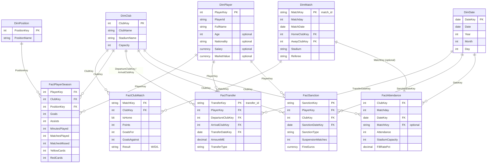

# Power BI Star Schema Design — Ligue 1 Dashboard 2023–2024

**Purpose:** Define the final star schema (tables, relationships, measures) to build in Power BI so that all 5 dashboard pages can be implemented. The model is loadable via **Power Query** from the existing CSV/TSV sources, with clear transformation steps.

**Reference:** [0_POWER_BI_DASHBOARD_SPECIFICATION.md](./0_POWER_BI_DASHBOARD_SPECIFICATION.md)

---

## 1. Design principles

| Principle | Application |
|-----------|-------------|
| **Single grain per fact** | Each fact table has one clear grain (e.g. one row per club per match), so measures are simple SUM/COUNT and filters behave predictably. |
| **Dimensions as lookup tables** | Clubs, players, positions, dates are dimensions; no repeated text on facts — only foreign keys. Enables consistent filtering and “single source of truth” for names. |
| **Denormalize for reporting** | Where a dimension attribute is used in many visuals (e.g. matchday, match date), it can live on the fact or on a small dimension (DimMatch) to avoid extra joins in DAX. |
| **Avoid double-filter traps** | Match results are stored as **two rows per match** (one per participating club) in `FactClubMatch`, so “filter by club” gives that club’s view without complex home/away logic in every measure. |
| **Power Query–first** | All tables are derived from CSV/TSV in PQ: normalise dates, amounts, and text; resolve keys (club, player, date); add calculated columns only where needed for clarity; leave complex logic (rank, form, contribution %) to DAX measures. |

---

## 2. High-level diagram (star schema)

---

## 3. Dimension tables

### 3.1 DimClub

| Column | Type | Source | Notes |
|--------|------|--------|--------|
| **ClubKey** | Whole number (PK) | PQ: index or hash | Surrogate key; use for relationships. |
| **ClubName** | Text | Distinct from match_results (home_team / away_team), player_stats (club), transfers, stadium_attendance, sanctions | Single list; dedupe and trim in PQ from all sources. |
| **StadiumName** | Text | Optional from match_results.stadium or stadium_attendance | One stadium per club; fill from first occurrence. |
| **Capacity** | Whole number | Optional from stadium_attendance.stadium_capacity | Max capacity; take max or first non-null per club. |

**Power Query:**  
- Collect distinct `ClubName` from: `match_results[home_team]`, `match_results[away_team]`, `player_stats[club]`, `transfers[departure_club]`, `transfers[arrival_club]`, `stadium_attendance[club]`, `disciplinary_sanctions[club]`.  
- Merge and remove duplicates; add `ClubKey` (e.g. `Table.AddIndexColumn(..., 1, 1)`).  
- Optionally merge stadium/capacity from stadium_attendance (Group By club, take Max capacity, First stadium).

**Design choice:** One dimension for clubs ensures the same name is used everywhere and report filters (e.g. “Paris SG”) apply to all facts.

---

### 3.2 DimPlayer

| Column | Type | Source | Notes |
|--------|------|--------|--------|
| **PlayerKey** | Whole number (PK) | PQ: index | Surrogate key. |
| **PlayerId** | Text | player_stats.player_id, transfers.player_id, sanctions.player_id | Natural key; must be unique. |
| **FullName** | Text | player_stats.full_name (or transfers.player) | Use player_stats as master; reconcile with transfers/sanctions by player_id. |
| **Age** | Whole number | Optional: players.xlsx or future source | Leave null if not available. |
| **Nationality** | Text | Optional: players.xlsx or future source | Leave null if not available. |
| **Salary** | Currency | Optional: players.xlsx or club_finances | Leave null if not available. |
| **MarketValue** | Currency | Optional: players.xlsx or future source | Leave null if not available. |

**Power Query:**  
- Start from `player_stats_season`: distinct `player_id`, `full_name`; add `PlayerKey`.  
- If `players.xlsx` exists: merge by `player_id` to bring in Age, Nationality, Salary, MarketValue.

**Design choice:** Player attributes that don’t change per match (age, nationality, value) live in DimPlayer; season-level performance stays in FactPlayerSeason.

---

### 3.3 DimPosition

| Column | Type | Source | Notes |
|--------|------|--------|-------|
| **PositionKey** | Whole number (PK) | PQ: index | Surrogate key. |
| **PositionName** | Text | player_stats.position (distinct) | Trim and standardise (e.g. “Left back”, “Forward”). |

**Power Query:**  
- From `player_stats_season`: distinct `position`; add `PositionKey`.  
- Use this to replace position text with PositionKey in the player-season fact.

**Design choice:** Position as a dimension allows position-based filters and “position depth” visuals without storing long text on the fact.

---

### 3.4 DimDate

| Column | Type | Source | Notes |
|--------|------|--------|-------|
| **DateKey** | Date (PK) | PQ: list of dates | Use as relationship key (Date data type). |
| **Date** | Date | Same | For display. |
| **Year** | Whole number | From Date | For grouping. |
| **Month** | Whole number | From Date | For grouping. |
| **Day** | Whole number | From Date | Optional. |

**Power Query:**  
- Build a calendar from the min/max dates present in match_results, transfers, sanctions, stadium_attendance (e.g. 2023-07-01 to 2024-08-31).  
- `List.Dates(...)` then `Table.FromList`; add Year/Month/Day columns.  
- Use for relationships: FactTransfer[TransferDateKey], FactSanction[SanctionDateKey], FactAttendance[DateKey]; optionally DimMatch[MatchDate] as date for display only (or add MatchDateKey to DimMatch if you want time intelligence on matches).

**Design choice:** A single calendar dimension supports time-based reporting and future time intelligence (YTD, prior year) if needed.

---

### 3.5 DimMatch

| Column | Type | Source | Notes |
|--------|------|--------|-------|
| **MatchKey** | Text (PK) | match_results.match_id | Natural key; one row per match. |
| **Matchday** | Whole number | match_results.matchday | 1–38; used for rank evolution and form. |
| **MatchDate** | Date | match_results.match_date (normalised) | Normalise all date formats in PQ. |
| **HomeClubKey** | Whole number (FK) | Resolve home_team → DimClub.ClubKey | |
| **AwayClubKey** | Whole number (FK) | Resolve away_team → DimClub.ClubKey | |
| **Stadium** | Text | match_results.stadium | Optional. |
| **Referee** | Text | match_results.referee | Optional. |

**Power Query:**  
- Load `match_results_2023_2024.csv`; normalise `match_date` to a single Date type (handle “2023-08-12”, “19 Aug 2023”, “18/08/2023”).  
- Merge with DimClub twice: match[home_team] → DimClub[ClubName] → HomeClubKey; match[away_team] → DimClub[ClubName] → AwayClubKey.  
- Select MatchKey, Matchday, MatchDate, HomeClubKey, AwayClubKey, Stadium, Referee.

**Design choice:** DimMatch holds the “when” and “who played” of each match. FactClubMatch stores the outcome per club (points, goals) so that filtering by club is a single filter on ClubKey; rank and form are implemented in DAX over FactClubMatch + DimMatch.

---

## 4. Fact tables

### 4.1 FactClubMatch (grain: one row per club per match)

**Grain:** For each match there are **two** rows: one for the home club, one for the away club.

| Column | Type | Source / logic | Notes |
|--------|------|----------------|-------|
| **MatchKey** | Text (FK) | match_id | Links to DimMatch. |
| **ClubKey** | Whole number (FK) | home_team or away_team → DimClub.ClubKey | |
| **IsHome** | Logical | true for home_team row, false for away_team | For “Home vs Away” visuals. |
| **Points** | Whole number | 3 if win, 1 if draw, 0 if loss (from home_score/away_score) | Stored so SUM(Points) = total points. |
| **GoalsFor** | Whole number | home_score for home row, away_score for away row | |
| **GoalsAgainst** | Whole number | away_score for home row, home_score for away row | |
| **Result** | Text | "W" / "D" / "L" | For W/D/L split and form. |

**Power Query:**  
1. Load match_results; normalise dates; add HomeClubKey, AwayClubKey via DimClub.  
2. Create “home” rows: MatchKey, ClubKey = HomeClubKey, IsHome = true, Points = if home_score > away_score then 3 else if home_score = away_score then 1 else 0, GoalsFor = home_score, GoalsAgainst = away_score, Result = W/D/L.  
3. Create “away” rows: same match, ClubKey = AwayClubKey, IsHome = false, Points/GoalsFor/GoalsAgainst/Result for away side.  
4. Combine (Table.Combine) home and away rows.  
5. Remove original score columns if not needed on the fact.

**Design choice:** Two rows per match makes “select a club and see all its results” a simple filter on ClubKey. Cumulative points, rank, home/away split, and form (last 5) are all straightforward in DAX over this fact + DimMatch (matchday/date).

---

### 4.2 FactPlayerSeason (grain: one row per player)

**Grain:** One row per player for the season (aggregate from player_stats_season).

| Column | Type | Source | Notes |
|--------|------|--------|-------|
| **PlayerKey** | Whole number (FK) | player_id → DimPlayer.PlayerKey | |
| **ClubKey** | Whole number (FK) | club → DimClub.ClubKey | |
| **PositionKey** | Whole number (FK) | position → DimPosition.PositionKey | |
| **Goals** | Whole number | player_stats.goals (clean spaces) | |
| **Assists** | Whole number | player_stats.assists (clean spaces) | |
| **MinutesPlayed** | Whole number | player_stats.minutes_played (strip " min", number) | |
| **MatchesPlayed** | Whole number | player_stats.matches_played | |
| **MatchesMissed** | Whole number | PQ: 38 - MatchesPlayed (or blank for GK) | For “matches missed” visual. |
| **Starts** | Whole number | player_stats.starts | |
| **YellowCards** | Whole number | player_stats.yellow_cards | |
| **RedCards** | Whole number | player_stats.red_cards | |
| **Shots**, **ShotsOnTarget**, **CleanSheets**, **Saves**, **SuccessfulDribbles**, **Interceptions**, **SuccessfulTackles** | Number | player_stats | Optional; include if needed for detailed visuals. |

**Power Query:**  
- Load player_stats_season; normalise numeric columns (trim, replace " min", fix decimals).  
- Merge club → DimClub → ClubKey; position → DimPosition → PositionKey; player_id → DimPlayer → PlayerKey.  
- Add MatchesMissed = 38 - MatchesPlayed.  
- Select only the columns that will exist in the fact (keys + measures).

**Design choice:** Season-level aggregates live in one fact so “goals/assists leaders”, “contribution %”, “minutes distribution”, “position depth” and “value vs performance” (with DimPlayer value fields) are simple.

---

### 4.3 FactTransfer (grain: one row per transfer)

| Column | Type | Source | Notes |
|--------|------|--------|-------|
| **TransferKey** | Text (PK) | transfer_id | |
| **PlayerKey** | Whole number (FK) | player_id → DimPlayer.PlayerKey | |
| **DepartureClubKey** | Whole number (FK) | departure_club → DimClub; use 0 or blank for “external” | Ligue 1 clubs only in DimClub; external clubs can map to a single “External” club or null. |
| **ArrivalClubKey** | Whole number (FK) | arrival_club → DimClub | |
| **TransferDateKey** | Date (FK) | transfer_date (normalised) | Must exist in DimDate. |
| **AmountME** | Decimal | amount_ME (normalised to numeric, e.g. M€) | Parse "56.9M€", "67.3 M" in PQ. |
| **TransferType** | Text | transfer_type (Purchase, Loan, Free transfer, etc.) | |

**Power Query:**  
- Load transfers (tab delimiter); normalise `transfer_date`; parse `amount_ME` (remove "M€", " M", spaces; then Number.From).  
- Merge player_id → DimPlayer; departure_club and arrival_club → DimClub (add row “External” in DimClub for non-Ligue 1 if desired).  
- Add TransferDateKey as the date used for DimDate relationship.

**Design choice:** One row per transfer supports “transfers in/out by club”, “new signings contribution” (join to FactPlayerSeason by PlayerKey + ArrivalClubKey = ClubKey), and “cost per point” (spend by club / points from FactClubMatch).

---

### 4.4 FactSanction (grain: one row per sanction)

| Column | Type | Source | Notes |
|--------|------|--------|-------|
| **SanctionKey** | Text (PK) | sanction_id | |
| **PlayerKey** | Whole number (FK) | player_id → DimPlayer.PlayerKey | |
| **ClubKey** | Whole number (FK) | club → DimClub.ClubKey | |
| **SanctionDateKey** | Date (FK) | sanction_date (normalised) | |
| **SanctionType** | Text | sanction_type | |
| **SuspensionMatches** | Whole number | suspension_matches (null → 0 or blank) | |
| **FineEuros** | Currency | fine_euros (null → blank) | |
| **Reason** | Text | reason | Optional. |

**Power Query:**  
- Load disciplinary_sanctions; normalise sanction_date; merge player_id → DimPlayer, club → DimClub; add SanctionDateKey for DimDate.

**Design choice:** Sanctions as a fact allow “cards and impact” and “suspensions” visuals; “matches missed” remains primarily from FactPlayerSeason (MatchesMissed).

---

### 4.5 FactAttendance (grain: one row per home match)

**Grain:** One row per (club, matchday) where the club is the home team — aligns with stadium_attendance.

| Column | Type | Source | Notes |
|--------|------|--------|-------|
| **ClubKey** | Whole number (FK) | club → DimClub.ClubKey | Home team. |
| **Matchday** | Whole number | matchday | 1–38. |
| **DateKey** | Date (FK) | date (normalised) | For DimDate; same date as match. |
| **MatchKey** | Text (FK) | Optional: match from match_results (home_team + matchday + date) | Enables link to DimMatch/FactClubMatch if needed. |
| **Attendance** | Whole number | attendance | |
| **StadiumCapacity** | Whole number | stadium_capacity | |
| **FillRatePct** | Decimal | fill_rate (replace comma by dot; e.g. 96,6 → 96.6) | For capacity utilization %. |
| **Weather** | Text | weather | Optional. |
| **TemperatureC** | Number | temperature_c | Optional. |

**Power Query:**  
- Load stadium_attendance (semicolon delimiter); normalise date and FillRate (replace "," by "."); merge club → DimClub → ClubKey.  
- Optionally: merge (ClubKey, Matchday, Date) to match_results (HomeClubKey, Matchday, MatchDate) to get MatchKey and add to FactAttendance for a single “match” context.

**Design choice:** One row per home match is the natural grain of the source; linking to DimDate allows attendance trend and capacity utilization by date/matchday.

---

## 5. Relationships (data model)

| From (Fact/Dim) | To (Dim) | Cardinality | Filter direction | Notes |
|-----------------|----------|-------------|------------------|--------|
| FactClubMatch[MatchKey] | DimMatch[MatchKey] | Many → One | Single | Match context (matchday, date). |
| FactClubMatch[ClubKey] | DimClub[ClubKey] | Many → One | Single | Filter by club. |
| FactPlayerSeason[PlayerKey] | DimPlayer[PlayerKey] | Many → One | Single | |
| FactPlayerSeason[ClubKey] | DimClub[ClubKey] | Many → One | Single | |
| FactPlayerSeason[PositionKey] | DimPosition[PositionKey] | Many → One | Single | |
| FactTransfer[PlayerKey] | DimPlayer[PlayerKey] | Many → One | Single | |
| FactTransfer[DepartureClubKey] | DimClub[ClubKey] | Many → One | Single | Transfers out. |
| FactTransfer[ArrivalClubKey] | DimClub[ClubKey] | Many → One | Single | Transfers in. |
| FactTransfer[TransferDateKey] | DimDate[DateKey] | Many → One | Single | |
| FactSanction[PlayerKey] | DimPlayer[PlayerKey] | Many → One | Single | |
| FactSanction[ClubKey] | DimClub[ClubKey] | Many → One | Single | |
| FactSanction[SanctionDateKey] | DimDate[DateKey] | Many → One | Single | |
| FactAttendance[ClubKey] | DimClub[ClubKey] | Many → One | Single | |
| FactAttendance[DateKey] | DimDate[DateKey] | Many → One | Single | |
| FactAttendance[MatchKey] | DimMatch[MatchKey] | Many → One | Single (optional) | Only if MatchKey is populated. |

**Design choice:** All filter directions “Single” from dimension to fact keep filter propagation simple (e.g. select a club → all facts for that club filter). No many-to-many required if club names are unified in DimClub.

---

## 6. Key DAX measures

Measures are defined in the appropriate fact table or a dedicated “Measures” table. Below are the main ones for the 5 pages.

### 6.1 Page 1 — Season performance

| Measure | Definition (conceptual) | Purpose |
|---------|-------------------------|---------|
| **Total Points** | `SUM(FactClubMatch[Points])` | KPI card. |
| **Total Goals For** | `SUM(FactClubMatch[GoalsFor])` | |
| **Total Goals Against** | `SUM(FactClubMatch[GoalsAgainst])` | |
| **Matches Played** | `COUNTROWS(FactClubMatch)` | Should be 38 per club. |
| **Wins / Draws / Losses** | `CALCULATE(COUNTROWS(FactClubMatch), FactClubMatch[Result] = "W")` (same for "D", "L") | W/D/L split. |
| **Cumulative Points (at matchday)** | For rank evolution: `VAR MaxMD = MAX(DimMatch[Matchday]) RETURN CALCULATE(SUM(FactClubMatch[Points]), DimMatch[Matchday] <= MaxMD, ALL(DimMatch[Matchday]))` — or use a table with (ClubKey, Matchday, CumulativePoints) if pre-calculated. | Points accumulation & rank. |
| **League Rank (at matchday)** | `RANKX(ALL(DimClub[ClubKey]), [Cumulative Points], [Cumulative Points], DESC, Dense)` with correct filter context (e.g. by matchday). | Rank evolution line chart. |
| **Home Points / Away Points** | `CALCULATE(SUM(FactClubMatch[Points]), FactClubMatch[IsHome] = TRUE/FALSE)` | Home vs away. |
| **Form (last 5 as text)** | Requires last 5 results: e.g. `CONCATENATEX(TOPN(5, ..., MatchDate, DESC), FactClubMatch[Result], "")` in a measure, or a calculated column on a club/matchday table. | Form timeline. |

**Note:** Rank evolution is easier if you have a **supporting table** (e.g. “StandingsByMatchday”) with one row per (ClubKey, Matchday) and columns CumulativePoints and Rank, built in PQ or as a calculated table in DAX from FactClubMatch + DimMatch. Then the line chart uses StandingsByMatchday[Matchday] and StandingsByMatchday[Rank].

---

### 6.2 Page 2 — Squad impact

| Measure | Definition | Purpose |
|---------|-------------|---------|
| **Total Goals** | `SUM(FactPlayerSeason[Goals])` | Leaders, contribution %. |
| **Total Assists** | `SUM(FactPlayerSeason[Assists])` | |
| **Goals + Assists** | `SUM(FactPlayerSeason[Goals]) + SUM(FactPlayerSeason[Assists])` | Combined contribution. |
| **Team Goals** | `SUM(FactPlayerSeason[Goals])` (in club context) | Denominator for contribution %. |
| **Contribution % (top N)** | e.g. percentage of team goals from selected/top N players; implement with RANKX or TOPN. | Contribution % visual. |
| **Minutes Played** | `SUM(FactPlayerSeason[MinutesPlayed])` | Distribution, depth. |
| **Matches Missed** | `SUM(FactPlayerSeason[MatchesMissed])` | Availability. |

Position depth: use DimPosition and FactPlayerSeason (e.g. bar chart: PositionName by SUM(MinutesPlayed) or COUNT(PlayerKey)).

---

### 6.3 Page 3 — Financial efficiency

| Measure | Definition | Purpose |
|---------|-------------|---------|
| **Transfer Spend (in)** | `SUM(FactTransfer[AmountME])` with filter `FactTransfer[ArrivalClubKey] = selected club` (or `RELATED(DimClub...)`). | Cost per point numerator. |
| **Transfer Revenue (out)** | `SUM(FactTransfer[AmountME])` for DepartureClubKey = selected club. | |
| **Net Transfer Spend** | Transfer Spend - Transfer Revenue (by club). | Squad value proxy. |
| **Cost per Point** | `DIVIDE([Transfer Spend], [Total Points], BLANK())` (by club). | KPI. |
| **Wage Bill** | If salary in DimPlayer: `SUMX(RELATEDTABLE(FactPlayerSeason), RELATED(DimPlayer[Salary]))` by club, or from club_finances if loaded. | Wage vs position (if data exists). |

Player-level “value vs production”: use DimPlayer (MarketValue or Salary) and FactPlayerSeason (Goals, Assists); scatter in a visual with axes from these.

---

### 6.4 Page 4 — Transfers, availability & risk

| Measure | Definition | Purpose |
|---------|-------------|---------|
| **Transfers In Count** | `COUNTROWS(FactTransfer)` with ArrivalClubKey = selected club. | Transfers in/out summary. |
| **Transfers Out Count** | Same for DepartureClubKey. | |
| **New Signings Contribution** | Sum of Goals/Assists from FactPlayerSeason for players who appear in FactTransfer with ArrivalClubKey = club and transfer date in chosen window; implement via USERELATIONSHIP or a flag “IsNewSigning” on FactPlayerSeason (set in PQ). | New signings visual. |
| **Total Suspension Matches** | `SUM(FactSanction[SuspensionMatches])` (by club or player). | Cards & impact. |
| **Total Fines** | `SUM(FactSanction[FineEuros])`. | |

Matches missed: use FactPlayerSeason[MatchesMissed] (no new measure).

---

### 6.5 Page 5 — Fans, stadium & summary

| Measure | Definition | Purpose |
|---------|-------------|---------|
| **Attendance** | `SUM(FactAttendance[Attendance])` (by club, matchday, or date). | Attendance trend. |
| **Avg Attendance** | `AVERAGE(FactAttendance[Attendance])` or total / match count. | |
| **Capacity Utilization %** | `AVERAGE(FactAttendance[FillRatePct])` or `SUM(Attendance)/SUM(StadiumCapacity)`. | Capacity utilization. |
| **Squad Value Rank** | If using transfer spend as proxy: `RANKX(ALL(DimClub), [Net Transfer Spend], ..., DESC)` (or Wage Bill if available). | Vs final rank. |
| **Final Rank** | Same as Page 1 rank at matchday 38; can be stored in a small “Standings” table (ClubKey, FinalRank, TotalPoints) built in PQ from FactClubMatch. | Summary panel. |

---

## 7. Supporting / calculated objects (optional)

| Object | Type | Purpose |
|--------|------|---------|
| **StandingsByMatchday** | Calculated table or PQ | One row per (ClubKey, Matchday) with CumulativePoints and Rank; feeds rank evolution and final rank. |
| **IsNewSigning** | Column (PQ or DAX) on FactPlayerSeason or DimPlayer | Flag players who have a transfer IN to that club in the season window; used for “new signings contribution”. |
| **FormLast5** | Calculated column or measure | Last 5 results (e.g. "WWDLW") per club per matchday; can be built in PQ by sorting matches and taking last 5. |
| **DimMatchday** | Small dimension | 1..38 with SortOrder; use for correct axis order on matchday. |

---

## 8. Power Query implementation order

Recommended order so dependencies resolve:

1. **DimClub** — from distinct club names across all sources; add ClubKey.  
2. **DimPosition** — from player_stats position; add PositionKey.  
3. **DimPlayer** — from player_stats (player_id, full_name); add PlayerKey; optionally merge players.xlsx.  
4. **DimDate** — calendar from min/max dates; add DateKey.  
5. **DimMatch** — from match_results; normalise date; resolve HomeClubKey, AwayClubKey; MatchKey = match_id.  
6. **FactClubMatch** — from match_results; duplicate rows for home/away; add Points, GoalsFor, GoalsAgainst, Result; resolve ClubKey, MatchKey.  
7. **FactPlayerSeason** — from player_stats; normalise numbers; resolve ClubKey, PlayerKey, PositionKey; add MatchesMissed.  
8. **FactTransfer** — from transfers; normalise amount_ME and date; resolve PlayerKey, DepartureClubKey, ArrivalClubKey, TransferDateKey.  
9. **FactSanction** — from disciplinary_sanctions; resolve PlayerKey, ClubKey, SanctionDateKey.  
10. **FactAttendance** — from stadium_attendance; normalise fill_rate and date; resolve ClubKey, DateKey; optionally MatchKey.  
11. **StandingsByMatchday** (optional) — in PQ: from FactClubMatch + DimMatch, group by ClubKey and Matchday, compute running sum of Points, then Rank per matchday; or create as a calculated table in DAX.

---

## 9. Summary

| Component | Role |
|-----------|------|
| **Star schema** | One fact per business process (matches, player season, transfers, sanctions, attendance); dimensions (Club, Player, Position, Date, Match) shared so filters apply consistently. |
| **FactClubMatch (2 rows per match)** | Makes “by club” reporting and rank/form/home-away simple without complex DAX. |
| **Single DimClub** | One place for club names; all facts link via ClubKey. |
| **DimDate** | Single calendar for transfers, sanctions, attendance (and optionally matches). |
| **Measures** | Concentrate logic in DAX; facts store only additive values. |
| **Power Query** | All tables and keys can be built in PQ with normalisation (dates, amounts, text) and merges to dimensions; optional calculated table for standings/form. |

This design supports the 5 dashboard pages from [0_POWER_BI_DASHBOARD_SPECIFICATION.md](./0_POWER_BI_DASHBOARD_SPECIFICATION.md) and remains extensible (e.g. add Salary/MarketValue/Wage/Revenue when data is available).
